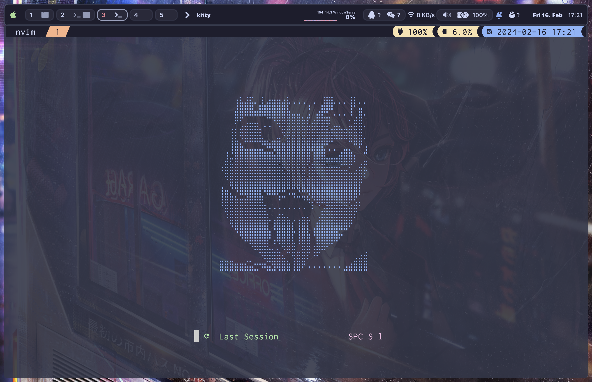

# AstroNvim User Configuration Example

A user configuration template for [AstroNvim](https://github.com/AstroNvim/AstroNvim)

## Introduction 

Hi,guys! In my workflow, I use _kitty_ and _wezterm_ as my terminal. What's more, I choose _tmux_ to provide me with multiple windows. _yazi_ is my terminal file manager._yabai_ is my desktop tiling manager

## Screenshot

`overall`



## 🛠️ Installation

#### Make a backup of your current nvim and shared folder

```shell
mv ~/.config/nvim ~/.config/nvim.bak
mv ~/.local/share/nvim ~/.local/share/nvim.bak
```

#### Clone AstroNvim

```shell
git clone https://github.com/AstroNvim/AstroNvim ~/.config/nvim
```

#### Clone this repository

```shell
git clone https://github.com/jakeiaCyber/neovim.git ~/.config/nvim/lua/user
```

#### Start Neovim

```shell
nvim
```

#### Uninstall Neovim

```shell
rm -rf ~/.config/nvim
rm -rf ~/.local/share/nvim
rm -rf ~/.local/state/nvim
rm -rf ~/.cache/nvim
```

## Todo

- [ ] add snippets for python,cpp ...
- [ ] python test and lsp config
- [x] sniprun keymapping
